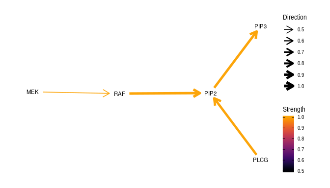

Introduction to Bayesian networks in R
======================================

About
-----

This repository contains a practical introduction to *Bayesian networks*
in `R` using `bnlearn` for teaching of a one-hour course.

Usage
-----

To go through the `R` tutorials do the following:

-   download the latest zip-file
    [here](https://github.com/dirmeier/bayesian-networks-introduction/releases)
    and extract it,
-   open *Rstudio*,
-   click *File -&gt; Open Project* and select
    `bayesian-networks-introduction.Rproj`,
-   open `R/tutorial.R`,
-   execute the tutorial line by line.

Session info
------------

    ## R version 3.5.1 (2018-07-02)
    ## Platform: x86_64-pc-linux-gnu (64-bit)
    ## Running under: Ubuntu 18.10
    ## 
    ## Matrix products: default
    ## BLAS: /usr/lib/x86_64-linux-gnu/openblas/libblas.so.3
    ## LAPACK: /usr/lib/x86_64-linux-gnu/libopenblasp-r0.3.3.so
    ## 
    ## locale:
    ##  [1] LC_CTYPE=en_US.UTF-8       LC_NUMERIC=C              
    ##  [3] LC_TIME=de_CH.UTF-8        LC_COLLATE=en_US.UTF-8    
    ##  [5] LC_MONETARY=de_CH.UTF-8    LC_MESSAGES=en_US.UTF-8   
    ##  [7] LC_PAPER=de_CH.UTF-8       LC_NAME=C                 
    ##  [9] LC_ADDRESS=C               LC_TELEPHONE=C            
    ## [11] LC_MEASUREMENT=de_CH.UTF-8 LC_IDENTIFICATION=C       
    ## 
    ## attached base packages:
    ## [1] stats     graphics  grDevices utils     datasets  methods   base     
    ## 
    ## other attached packages:
    ## [1] dplyr_0.8.1    igraph_1.2.4.1 ggraph_2.0.0   ggplot2_3.2.0 
    ## [5] bnlearn_4.5    dagitty_0.2-2 
    ## 
    ## loaded via a namespace (and not attached):
    ##  [1] tidyselect_0.2.5   xfun_0.7           purrr_0.3.2       
    ##  [4] graphlayouts_0.5.0 V8_2.3             colorspace_1.4-1  
    ##  [7] htmltools_0.3.6    viridisLite_0.3.0  yaml_2.2.0        
    ## [10] rlang_0.4.0        pillar_1.4.2       glue_1.3.1.9000   
    ## [13] withr_2.1.2        tweenr_1.0.1       stringr_1.4.0     
    ## [16] munsell_0.5.0      gtable_0.3.0       evaluate_0.13     
    ## [19] labeling_0.3       knitr_1.23         curl_3.3          
    ## [22] tidygraph_1.1.2    Rcpp_1.0.1         scales_1.0.0      
    ## [25] backports_1.1.4    jsonlite_1.6       farver_1.1.0      
    ## [28] gridExtra_2.3      ggforce_0.3.1      digest_0.6.20     
    ## [31] stringi_1.4.3      ggrepel_0.8.1      polyclip_1.10-0   
    ## [34] grid_3.5.1         rprojroot_1.3-2    here_0.1          
    ## [37] tools_3.5.1        magrittr_1.5       lazyeval_0.2.2    
    ## [40] tibble_2.1.3       crayon_1.3.4       tidyr_0.8.3       
    ## [43] pkgconfig_2.0.2    MASS_7.3-50        assertthat_0.2.1  
    ## [46] rmarkdown_1.13     viridis_0.5.1      R6_2.4.0          
    ## [49] boot_1.3-20        compiler_3.5.1

Author
------

Simon Dirmeier <a href="mailto:simon.dirmeier@web.de">simon.dirmeier @
web.de</a>

License
-------

 This
work is licensed under a
<a rel="license" href="http://creativecommons.org/licenses/by-nc/4.0/">Creative
Commons Attribution-NonCommercial 4.0 International License</a>.
